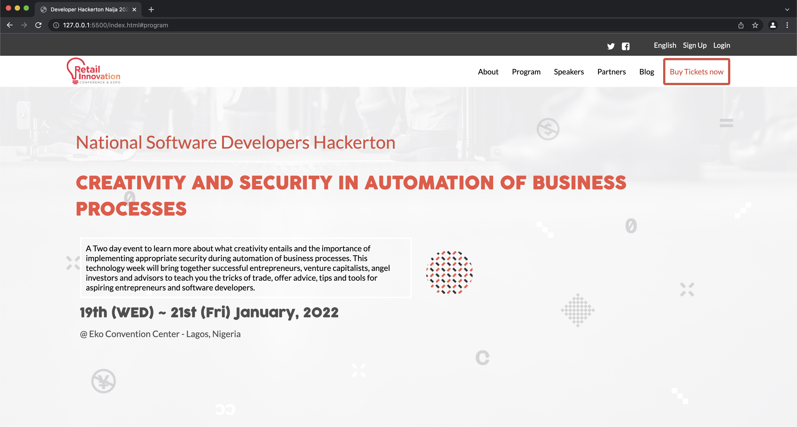

# Conference Website Capstone

Looking for a software conference to attend? you are in the right place. This website project serves the purpose of informing users about an upcoming IT conference, with an about page to give more information about the conference. Built with HTML, CSS and JavaScript.



 

## Presentation

[Live Demo Link](https://clintonjosephs.github.io/conference_website/)

[Demo video link](https://www.loom.com/share/8f39d53f7bdf4290bae8277a771c0868)
 
## Built With

- HTML
- CSS
- Javascript
- HTML&CSS Linter
- Git

## Get Started

Please get your browser update.
To get a local copy up and running follow these simple steps.

Run the command below from the Terminal:
```bash
$ git@github.com:clintonjosephs/conference_website.git
$ cd conference_website
$ start index.html
```


## Author

👤 **Clinton Mbonu**

- Location: Nigeria
- GitHub: [@clintonjosephs](https://github.com/clintonjosephs)
- Twitter: [@clintonmbonu_](https://twitter.com/clintonmbonu_)
- LinkedIn: [LinkedIn](https://linkedin.com/in/clinton-mbonu)


## 🤝 Contributing

Contributions, issues, and feature requests are welcome!

## Show your support

Give a ⭐️ if you like this project!

## Acknowledgments

This design is similar to the one created by [Cindy Shin](https://www.behance.net/gallery/29845175/CC-Global-Summit-2015) .

## 📝 License

This project is [MIT](LICENSE) licensed.
