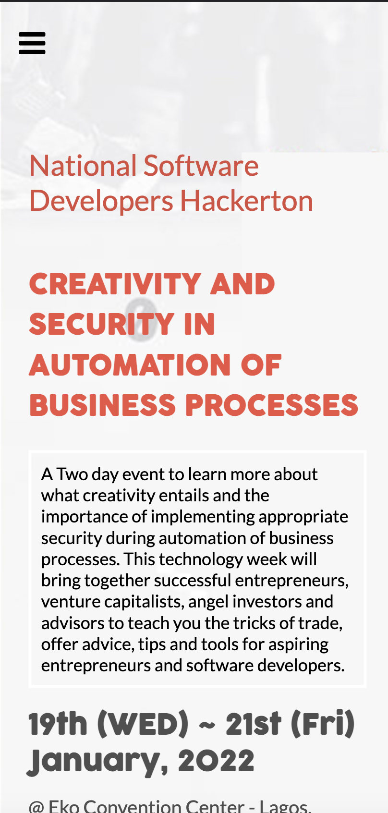

# Conference Website Capstone

This is a demo conference website project that serves the purpose of informing users about an upcoming IT conference, with an about page to give more information about the conference.

 

## Live Demo

[Live Demo Link](https://clintonjosephs.github.io/conference_website/)

[Demo video link](https://www.loom.com/share/8f39d53f7bdf4290bae8277a771c0868)
 
## Built With

- HTML
- CSS
- Javascript
- HTML&CSS Linter
- Git

## Get Started

Please get your browser update.
To get a local copy up and running follow these simple steps.

Run the command below from the Terminal:

      git clone <URL> in your terminal

	  cd conference-website

	  start index.html

## Author

👤 **Clinton Mbonu**

- Location: Nigeria
- GitHub: [@clintonjosephs](https://github.com/clintonjosephs)
- Twitter: [@clintonmbonu_](https://twitter.com/clintonmbonu_)
- LinkedIn: [LinkedIn](https://linkedin.com/in/clinton-mbonu)

## 🤝 Contributing

Contributions, issues, and feature requests are welcome!

Feel free to check the [issues page](https://github.com/codecaiine/conference-website/issues).

## Show your support

Give a ⭐️ if you like this project!

## Acknowledgments

This design is similar to the one created by [Cindy Shin](https://www.behance.net/gallery/29845175/CC-Global-Summit-2015) .

## 📝 License

This project is [MIT](LICENSE) licensed.
